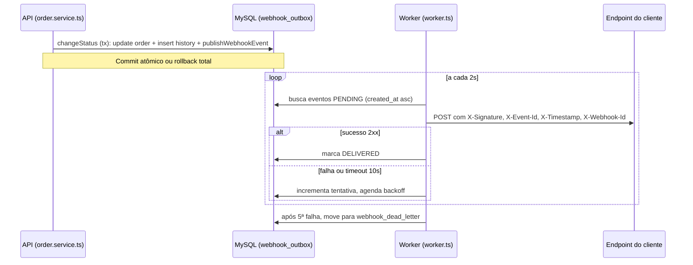

# FDD (Feature Design Document)

### FDD: Sistema de Webhooks de Notificação de Pedidos

Versão: 1.0
Data: 2026-09-07
Responsável: Larissa (Tech Lead)

---

### 1. Contexto e motivação técnica

O Order Management System hoje não tem nenhum mecanismo de notificação externa, eventos ou filas. Clientes B2B integrados (Atlas Comercial, MaxDistribuição e Nova Cargo) descobrem mudanças de status fazendo polling periódico em `GET /orders`, o que a Atlas descreveu como lento e caro do lado deles. As decisões de abordagem já estão fechadas em [ADR-001](adrs/ADR-001-outbox-no-mysql.md), [ADR-002](adrs/ADR-002-worker-separado-com-polling.md), [ADR-003](adrs/ADR-003-retry-com-backoff-e-dead-letter-queue.md), [ADR-004](adrs/ADR-004-hmac-sha256-com-secret-por-endpoint.md), [ADR-005](adrs/ADR-005-garantia-at-least-once-com-event-id.md) e [ADR-006](adrs/ADR-006-reuso-dos-padroes-existentes-do-projeto.md), e consolidadas em [docs/RFC.md](../RFC.md). Este documento não reabre nenhuma dessas decisões: detalha como implementá-las.

A restrição técnica central é o método `changeStatus` do serviço de pedidos (`src/modules/orders/order.service.ts`), que já executa, em uma única transação Prisma, a atualização de `orders`, a inserção em `order_status_history` e o ajuste de `stock_quantity` dos produtos do pedido. A notificação de webhook precisa se acoplar a essa transação sem se tornar sincronamente dependente da disponibilidade dos clientes externos.

O escopo é exclusivamente outbound: o sistema envia notificações para os clientes cadastrados; os clientes não enviam nada de volta ao sistema.

Atores: clientes B2B (donos dos endpoints de webhook cadastrados), usuários autenticados do OMS que operam o CRUD de configuração de webhook em nome de um customer, e usuários com role `ADMIN` que operam o replay manual de eventos em dead letter.

---

### 2. Objetivos técnicos

- Garantir atomicidade entre a mudança de status do pedido e o registro do evento de notificação: o evento em `webhook_outbox` só existe se a transação de `changeStatus` foi commitada, e desaparece junto se ela sofrer rollback (ADR-001).
- Entregar eventos aos clientes com latência mínima de 2 segundos (ciclo de polling do worker) e, no cenário sem falhas, dentro do teto de 10 segundos que os clientes definiram como "tempo real" (ADR-002).
- Garantir entrega at-least-once, com idempotência viabilizada por um `X-Event-Id` único e estável por evento, permitindo ao cliente deduplicar entregas duplicadas (ADR-005).
- Garantir que nenhuma falha permanente de entrega (após 5 tentativas em até ~15 horas) seja perdida silenciosamente: todo evento que esgota as tentativas é preservado em `webhook_dead_letter`, com payload, motivo da falha e timestamp, e é reprocessável manualmente (ADR-003).
- Isolar o impacto de um vazamento de credencial: cada endpoint de webhook tem sua própria secret HMAC-SHA256, nunca uma secret global da plataforma (ADR-004).
- Preservar a ordenação de eventos por pedido individual enquanto o processamento for single-worker; isso é documentado como limitação conhecida, não como garantia de ordenação global entre pedidos diferentes (ADR-002).

---

### 3. Escopo e exclusões

**Incluído**
- Tabela `webhook_outbox` e inserção do evento dentro da transação de `changeStatus`, via função `publishWebhookEvent(tx, order, fromStatus, toStatus)`.
- Processo `src/worker.ts`, separado da API, com polling a cada 2 segundos.
- Retry com backoff exponencial (5 tentativas: 1m, 5m, 30m, 2h, 12h) e Dead Letter Queue em tabela `webhook_dead_letter`.
- Endpoint administrativo de replay manual de eventos em dead letter, restrito a role `ADMIN`, com log de auditoria de quem executou o replay.
- CRUD de configuração de webhook por customer (criar, editar, remover, listar), com filtro de status de interesse aplicado no momento da inserção na outbox.
- Endpoint de rotação de secret, com grace period de 24 horas para a secret antiga.
- Endpoint de consulta ao histórico de entregas de um webhook (últimos 100 registros).
- Assinatura HMAC-SHA256 de cada notificação, validação de URL somente HTTPS, e limite de 64KB no payload do evento.
- Módulo `src/modules/webhooks`, seguindo a estrutura de controller/service/repository/routes/schemas já usada nos demais módulos, com classes de erro prefixadas `WEBHOOK_*`.

**Excluído**
- Alertar o cliente (por exemplo, por e-mail) quando o webhook dele acumula falhas consecutivas de entrega: adiado para uma fase futura, após medição de impacto real ([09:37] Larissa, [09:37]-[09:38] Marcos).
- Rate limiting de envio para um mesmo cliente quando muitos pedidos mudam de status em um curto intervalo: fora do escopo atual; a equipe decidiu observar antes de implementar qualquer controle ([09:38]-[09:39] Diego, Larissa).
- Garantia de ordenação global de eventos entre pedidos diferentes caso o sistema escale para múltiplos workers em paralelo: tratada como limitação conhecida, a resolver apenas se e quando a escala exigir ([09:12]-[09:13] Diego, Bruno, Larissa).
- Dashboard visual para o cliente acompanhar os webhooks cadastrados: fora de escopo desta fase, projeto separado do time de frontend ([09:39]-[09:40] Larissa, Marcos).
- Estratégia de arquivamento das linhas já entregues em `webhook_outbox`: fora do escopo desta feature ([09:08] Diego).
- Webhooks inbound (o cliente enviar eventos para o sistema): fora de escopo; a feature é exclusivamente outbound ([09:02]-[09:03] Marcos, Sofia).

---

### 4. Fluxos detalhados e diagramas

**Fluxo 1: criação do evento na outbox**
- Requisição `PATCH /api/v1/orders/:id/status` passa por `authenticate` e `validate` (padrão já existente, sem alteração).
- `OrderService.changeStatus` abre a transação Prisma já existente e executa as validações e efeitos colaterais de hoje (existência do pedido, `canTransition`, débito/reposição de estoque, update em `orders`, insert em `order_status_history`).
- Nova etapa, dentro da mesma transação: chamada a `publishWebhookEvent(tx, order, fromStatus, toStatus)`.
- `publishWebhookEvent` busca os `WebhookEndpoint` ativos do `customerId` do pedido cujo filtro de status inclui o `toStatus` da transição.
- Se nenhum endpoint corresponder ao status, nenhuma linha é inserida na outbox, economizando espaço na tabela ([09:34] Bruno, Diego).
- Para cada endpoint correspondente, insere uma linha em `webhook_outbox` com o payload já renderizado (snapshot no momento da inserção, não apenas uma referência ao `order_id`), decisão explícita para que o evento reflita o estado do pedido no momento da mudança de status, mesmo que o pedido seja alterado depois ([09:51]-[09:52] Larissa, Diego, Bruno).
- Se a inserção na outbox falhar, toda a transação sofre rollback: não pode existir mudança de status sem o evento correspondente ([09:40]-[09:41] Bruno, Diego).
- A transação commita: mudança de status e evento(s) de outbox tornam-se visíveis atomicamente.

**Fluxo 2: processamento pelo worker**
- `src/worker.ts` inicia como processo Node separado (`npm run worker`), com sua própria instância de `PrismaClient` apontando para a mesma `DATABASE_URL` (`PrismaClient` é por processo, não pode ser compartilhado com a API).
- Loop de polling a cada 2 segundos.
- A cada iteração, busca um lote pequeno de eventos com status `PENDING` cujo horário de próxima tentativa já chegou, ordenados por `created_at` ascendente (hipótese: tamanho de lote de até 20 eventos por iteração; não há um número literal definido na reunião, apenas "batch pequeno").
- Para cada evento do lote: monta o corpo JSON da notificação (já estava renderizado desde a inserção), calcula o HMAC-SHA256 do corpo com a secret ativa do endpoint, monta os headers (`X-Event-Id`, `X-Signature`, `X-Timestamp`, `X-Webhook-Id`, `Content-Type: application/json`).
- Realiza `POST` HTTP para a URL cadastrada, com timeout de 10 segundos ([09:42] Diego).
- Sucesso (`2xx`): marca o evento como `DELIVERED` na outbox e registra a tentativa no histórico de entregas (sucesso, status HTTP, tempo de resposta).
- Falha (timeout, erro de conexão, ou status fora de `2xx`): registra a tentativa como falha no histórico de entregas, incrementa o contador de tentativas e agenda a próxima tentativa conforme a tabela de backoff.

**Fluxo 3: retry com backoff exponencial**
- Progressão fixa de 5 tentativas: 1 minuto, 5 minutos, 30 minutos, 2 horas, 12 horas entre tentativas sucessivas (ADR-003, [09:17] Diego).
- Se a 5ª tentativa falhar, o evento é removido da `webhook_outbox` e uma linha correspondente é criada em `webhook_dead_letter`, com o payload completo, o motivo da última falha e o timestamp (ADR-003).

**Fluxo 4: dead letter e replay manual**
- Evento em `webhook_dead_letter` fica disponível para consulta e replay manual.
- Usuário com role `ADMIN` chama `POST /api/v1/admin/webhooks/dead-letter/:id/replay`.
- O endpoint reinsere o evento na `webhook_outbox` com status `PENDING` e contador de tentativas reiniciado, disponível para o próximo ciclo de polling do worker ([09:18] Diego).
- A ação de replay é registrada em log de auditoria, identificando qual usuário `ADMIN` executou o replay e quando ([09:36] Sofia).

**Diagrama (fluxo ponta a ponta)**



---

### 5. Contratos públicos (assinaturas, endpoints, headers, exemplos)

**1. Cadastro de webhook**
- Tipo: endpoint
- Assinatura ou rota: `POST /api/v1/webhooks`
- Semântica de status e headers:
  - `201 Created`: webhook cadastrado, secret retornada apenas nesta resposta
  - `400 Bad Request` (`WEBHOOK_INVALID_URL`): URL não usa HTTPS
  - `401 Unauthorized`: token JWT ausente ou inválido (padrão já existente)

**Exemplo de requisição**
```json
{
  "customerId": "1f9a2b3c-4d5e-4f60-8a71-9b2c3d4e5f60",
  "url": "https://cliente.exemplo.com/webhooks/order-events",
  "statuses": ["SHIPPED", "DELIVERED"]
}
```

**Exemplo de resposta**
```json
{
  "id": "b3f10a20-30b1-41c2-92d3-a4e5f6071829",
  "customerId": "1f9a2b3c-4d5e-4f60-8a71-9b2c3d4e5f60",
  "url": "https://cliente.exemplo.com/webhooks/order-events",
  "statuses": ["SHIPPED", "DELIVERED"],
  "secret": "whsec_5f2a8c91b3d4e5f60718293a4b5c6d7e",
  "active": true,
  "createdAt": "2026-09-07T13:00:00.000Z"
}
```

---

**2. Edição de webhook**
- Tipo: endpoint
- Assinatura ou rota: `PATCH /api/v1/webhooks/:id`
- Semântica de status e headers:
  - `200 OK`: webhook atualizado (secret nunca reexibida em edição)
  - `404 Not Found` (`WEBHOOK_NOT_FOUND`): id não existe ou não pertence ao customer

**Exemplo de requisição**
```json
{
  "url": "https://cliente.exemplo.com/webhooks/order-events-v2",
  "statuses": ["PAID", "SHIPPED", "DELIVERED"],
  "active": true
}
```

**Exemplo de resposta**
```json
{
  "id": "b3f10a20-30b1-41c2-92d3-a4e5f6071829",
  "customerId": "1f9a2b3c-4d5e-4f60-8a71-9b2c3d4e5f60",
  "url": "https://cliente.exemplo.com/webhooks/order-events-v2",
  "statuses": ["PAID", "SHIPPED", "DELIVERED"],
  "active": true,
  "updatedAt": "2026-09-07T13:10:00.000Z"
}
```

---

**3. Remoção de webhook**
- Tipo: endpoint
- Assinatura ou rota: `DELETE /api/v1/webhooks/:id`
- Semântica de status e headers:
  - `204 No Content`: removido com sucesso, sem corpo de resposta
  - `404 Not Found` (`WEBHOOK_NOT_FOUND`): id não existe

**Exemplo de requisição**
```
DELETE /api/v1/webhooks/b3f10a20-30b1-41c2-92d3-a4e5f6071829
```

**Exemplo de resposta**
```
204 No Content
```

---

**4. Listagem de webhooks de um customer**
- Tipo: endpoint
- Assinatura ou rota: `GET /api/v1/webhooks?customerId=...&page=1&pageSize=20`
- Semântica de status e headers:
  - `200 OK`: lista paginada, seguindo o helper `paginated()` já usado nos demais módulos (`src/shared/http/response.ts`)

**Exemplo de requisição**
```
GET /api/v1/webhooks?customerId=1f9a2b3c-4d5e-4f60-8a71-9b2c3d4e5f60&page=1&pageSize=20
```

**Exemplo de resposta**
```json
{
  "data": [
    {
      "id": "b3f10a20-30b1-41c2-92d3-a4e5f6071829",
      "customerId": "1f9a2b3c-4d5e-4f60-8a71-9b2c3d4e5f60",
      "url": "https://cliente.exemplo.com/webhooks/order-events-v2",
      "statuses": ["PAID", "SHIPPED", "DELIVERED"],
      "active": true,
      "createdAt": "2026-09-07T13:00:00.000Z"
    }
  ],
  "pagination": { "page": 1, "pageSize": 20, "total": 1, "totalPages": 1 }
}
```

---

**5. Histórico de entregas de um webhook**
- Tipo: endpoint
- Assinatura ou rota: `GET /api/v1/webhooks/:id/deliveries?page=1&pageSize=20`
- Semântica de status e headers:
  - `200 OK`: lista paginada, até os últimos 100 registros disponíveis ([09:34] Marcos)
  - `404 Not Found` (`WEBHOOK_NOT_FOUND`): webhook não existe

**Exemplo de requisição**
```
GET /api/v1/webhooks/b3f10a20-30b1-41c2-92d3-a4e5f6071829/deliveries?page=1&pageSize=20
```

**Exemplo de resposta**
```json
{
  "data": [
    {
      "eventId": "6f9c2e10-71a2-4b83-9c04-d5e6f7081930",
      "success": true,
      "httpStatus": 200,
      "durationMs": 184,
      "attemptedAt": "2026-09-07T13:05:22.481Z"
    },
    {
      "eventId": "5e8b1d09-60f1-4a72-8b93-c4d5e6f70819",
      "success": false,
      "httpStatus": 503,
      "durationMs": 10000,
      "attemptedAt": "2026-09-07T12:58:10.203Z"
    }
  ],
  "pagination": { "page": 1, "pageSize": 20, "total": 2, "totalPages": 1 }
}
```

---

**6. Rotação de secret**
- Tipo: endpoint
- Assinatura ou rota: `POST /api/v1/webhooks/:id/rotate-secret`
- Semântica de status e headers:
  - `200 OK`: nova secret gerada; secret anterior permanece válida por 24 horas em paralelo ([09:21] Sofia)
  - `404 Not Found` (`WEBHOOK_NOT_FOUND`): webhook não existe

**Exemplo de requisição**
```
POST /api/v1/webhooks/b3f10a20-30b1-41c2-92d3-a4e5f6071829/rotate-secret
```

**Exemplo de resposta**
```json
{
  "id": "b3f10a20-30b1-41c2-92d3-a4e5f6071829",
  "secret": "whsec_9a1b2c3d4e5f60718293a4b5c6d7e8f9",
  "previousSecretExpiresAt": "2026-09-08T13:00:00.000Z"
}
```

---

**7. Replay administrativo de dead letter**
- Tipo: endpoint
- Assinatura ou rota: `POST /api/v1/admin/webhooks/dead-letter/:id/replay`
- Semântica de status e headers:
  - `200 OK`: evento recolocado em `webhook_outbox` como `PENDING`
  - `401 Unauthorized` / `403 Forbidden`: sem token ou sem role `ADMIN` (reaproveita `requireRole`, [09:36] Sofia)
  - `404 Not Found` (`WEBHOOK_DEAD_LETTER_NOT_FOUND`): id não existe na dead letter

**Exemplo de requisição**
```
POST /api/v1/admin/webhooks/dead-letter/5e8b1d09-60f1-4a72-8b93-c4d5e6f70819/replay
Authorization: Bearer <token de usuário ADMIN>
```

**Exemplo de resposta**
```json
{
  "id": "5e8b1d09-60f1-4a72-8b93-c4d5e6f70819",
  "status": "PENDING",
  "requeuedAt": "2026-09-07T14:00:00.000Z"
}
```

---

**8. Notificação enviada ao cliente (contrato outbound)**
- Tipo: chamada HTTP outbound do worker para a URL cadastrada pelo cliente
- Método: `POST` para a URL do endpoint cadastrado
- Semântica de status e headers:
  - `X-Event-Id`: UUID único do evento, usado pelo cliente para deduplicar (ADR-005)
  - `X-Signature`: HMAC-SHA256 do corpo, calculado com a secret do endpoint (ADR-004)
  - `X-Timestamp`: timestamp ISO 8601 do envio, permite ao cliente detectar replay attack
  - `X-Webhook-Id`: id do cadastro de webhook que gerou o envio, útil para clientes com múltiplos cadastros
  - `Content-Type: application/json`
  - Qualquer resposta fora de `2xx`, ou ausência de resposta em 10 segundos, conta como falha de entrega

**Exemplo de requisição (enviada pelo worker ao cliente)**
```json
{
  "event_id": "6f9c2e10-71a2-4b83-9c04-d5e6f7081930",
  "event_type": "order.status_changed",
  "timestamp": "2026-09-07T13:05:22.481Z",
  "order_id": "3ac1b2c3-d4e5-4f60-8172-93a4b5c6d7e8",
  "order_number": "ORD-000482",
  "from_status": "PROCESSING",
  "to_status": "SHIPPED",
  "customer_id": "1f9a2b3c-4d5e-4f60-8a71-9b2c3d4e5f60",
  "total_cents": 458900
}
```

**Exemplo de resposta esperada do cliente**
```
200 OK
```

---

### 6. Erros, exceções e fallback

**Matriz de erros**

| Código | Condição | Tratamento | Notas |
| --- | --- | --- | --- |
| `WEBHOOK_NOT_FOUND` | Webhook com o id informado não existe ou não pertence ao customer | `404`, sem retry | Citado literalmente na reunião ([09:28] Bruno) |
| `WEBHOOK_INVALID_URL` | URL cadastrada ou editada não usa HTTPS | `400`, rejeitado antes de persistir | Citado literalmente na reunião ([09:23] Sofia, [09:28] Bruno) |
| `WEBHOOK_SECRET_REQUIRED` | Tentativa de assinar ou enviar um evento para um endpoint sem secret ativa válida | `500` interno, evento não é enviado | Citado literalmente na reunião ([09:28] Bruno); invariante interno, não deveria ocorrer em operação normal |
| `WEBHOOK_PAYLOAD_TOO_LARGE` | Payload do evento ultrapassa 64KB | `422`, evento rejeitado antes do envio, nunca truncado | Decisão explícita ([09:23]-[09:24] Sofia, Diego, Larissa) |
| `WEBHOOK_DEAD_LETTER_NOT_FOUND` (hipótese) | Id informado no replay não existe em `webhook_dead_letter` | `404` | Extensão do padrão `WEBHOOK_*` por analogia a `WEBHOOK_NOT_FOUND`; não citado literalmente na reunião, precisa de confirmação |
| `WEBHOOK_DELIVERY_TIMEOUT` (hipótese) | Chamada HTTP ao cliente não responde em 10 segundos | Registrado como motivo de falha, segue fluxo de retry | Timeout de 10s é decisão explícita ([09:42] Diego); o código específico para registrar o motivo não foi nomeado na reunião |
| `WEBHOOK_DELIVERY_FAILED` (hipótese) | Cliente responde com status HTTP fora de `2xx`, ou erro de conexão | Registrado como motivo de falha, segue fluxo de retry | Comportamento de retry decidido (ADR-003); o código específico do motivo não foi nomeado na reunião |

**Estratégias de resiliência**
- Timeout de 10 segundos por chamada HTTP de entrega ([09:42] Diego).
- Retry com backoff exponencial, 5 tentativas (1m, 5m, 30m, 2h, 12h) (ADR-003).
- Fallback: eventos que esgotam as tentativas vão para `webhook_dead_letter`, preservando payload e motivo, com replay manual disponível (ADR-003).
- Circuit breaker por endpoint não foi discutido nem decidido na reunião; nesta fase, o mecanismo de fallback é a combinação de retry limitado mais dead letter, não um circuit breaker dedicado. Isso não é uma omissão silenciosa: fica registrado aqui como algo não avaliado, semelhante ao rate limiting de saída já listado como questão em aberto no RFC.

**Invariantes**
- Nunca existe um evento de webhook para uma mudança de status cuja transação sofreu rollback (ADR-001).
- Nunca é enviado um evento cujo payload ultrapasse 64KB.
- Nunca é usada uma secret global para assinar mais de um endpoint (ADR-004).

---

### 7. Observabilidade

**Métricas** (hipótese: nomes não definidos na reunião, propostos seguindo a convenção de nomenclatura de métricas por evento/contagem/latência já esperada em sistemas do tipo outbox/worker)
- `webhook_outbox_pending_total`: quantidade de eventos pendentes na outbox, para detectar acúmulo.
- `webhook_delivery_attempts_total{outcome="success"|"failure"}`: contagem de tentativas de entrega por resultado.
- `webhook_delivery_duration_seconds`: histograma de duração da chamada HTTP de entrega.
- `webhook_dead_letter_total`: quantidade de eventos atualmente em dead letter.

**Logs**
- Reaproveita o logger Pino já configurado (`src/shared/logger/index.ts`), sem introduzir nova biblioteca.
- Cada tentativa de entrega deve logar, no mínimo: `event_id`, `webhook_endpoint_id`, `order_id`, `attempt_count`, `outcome` (sucesso ou falha), `duration_ms`.
- O array `redactPaths` já existente no logger precisa ser estendido para incluir os campos de secret e assinatura do módulo de webhooks (por exemplo `*.secret`, `*.signature`), seguindo o mesmo padrão já usado para `*.password` e `*.token`, para não vazar credencial em log.

**Tracing**
- O projeto não tem hoje nenhuma biblioteca de tracing distribuído (não há dependência de OpenTelemetry ou equivalente no `package.json`). Proposta mínima (hipótese): usar o `event_id` como identificador de correlação manual, logado em todos os pontos do ciclo de vida do evento (inserção na outbox, cada tentativa do worker, resultado da chamada ao cliente), permitindo reconstruir o percurso completo de um evento a partir dos logs até que uma solução de tracing dedicada seja adotada pelo projeto como um todo.

**Dashboards e alertas** (hipótese)
- Painel com taxa de falha de entrega, tamanho da fila de pendentes e tamanho da dead letter.
- Alerta quando `webhook_dead_letter_total` cresce de forma anormal, sinal de que um cliente está indisponível há tempo suficiente para esgotar as 5 tentativas.

---

### 8. Dependências e compatibilidade

| Componente | Versão mínima | Observações |
| --- | --- | --- |
| `@prisma/client` | 5.22.0 (já no projeto) | Reaproveitado; worker abre instância própria de `PrismaClient` apontando para a mesma `DATABASE_URL` |
| `express` | 4.21.1 (já no projeto) | Reaproveitado para o novo módulo `src/modules/webhooks` |
| `zod` | 3.23.8 (já no projeto) | Reaproveitado para os novos schemas de validação |
| `pino` | 9.5.0 (já no projeto) | Reaproveitado; `redactPaths` precisa ser estendido |
| `node:crypto` (módulo nativo do Node) | Node >= 20 (já exigido pelo projeto) | Usado para HMAC-SHA256; não introduz nenhuma dependência externa nova |

**Garantias de compatibilidade**
- O novo módulo é montado sob o mesmo prefixo de versão de API já usado pelos demais módulos (`/api/v1`), sem introduzir uma nova convenção de versionamento.
- Nenhum contrato existente (`orders`, `customers`, `products`, `users`, `auth`) é alterado; a única mudança em código já existente é a extensão do método `changeStatus`.

---

### Integração com o sistema existente

**`src/modules/orders/order.service.ts`**
O método `changeStatus` será estendido para, dentro da mesma transação Prisma (`$transaction`) já existente, chamar `publishWebhookEvent(tx, order, fromStatus, toStatus)` logo após o insert em `order_status_history`. Isso garante que a inserção na nova tabela `webhook_outbox` participe da mesma atomicidade que hoje já cobre a atualização de `orders` e o ajuste de `stock_quantity`.

**`src/shared/errors/app-error.ts` e `src/shared/errors/http-errors.ts`**
Novas subclasses de erro do módulo webhooks (por exemplo `WebhookNotFoundError`, `InvalidWebhookUrlError`, `WebhookPayloadTooLargeError`) estendem `AppError`, seguindo exatamente o mesmo padrão de `InsufficientStockError` e `InvalidStatusTransitionError`, com códigos prefixados `WEBHOOK_*` em vez de reaproveitar os códigos genéricos já existentes.

**`src/shared/errors/index.ts`**
As novas classes de erro do módulo webhooks são reexportadas aqui, no mesmo padrão em que `BadRequestError`, `NotFoundError` e as demais classes já são centralizadas.

**`src/middlewares/error.middleware.ts`**
Reaproveitado sem nenhuma alteração: como já reconhece qualquer instância de `AppError` automaticamente, os novos erros `WEBHOOK_*` são serializados corretamente sem precisar tocar neste arquivo.

**`src/middlewares/auth.middleware.ts`**
O middleware `requireRole('ADMIN')` já existente é reaproveitado diretamente para restringir o endpoint `POST /api/v1/admin/webhooks/dead-letter/:id/replay` a usuários com essa role.

**`src/shared/logger/index.ts`**
O logger Pino já configurado é reaproveitado tanto pela API quanto pelo novo processo `src/worker.ts`. O array `redactPaths` precisa ser estendido para cobrir os campos de secret e assinatura do módulo de webhooks.

**`src/server.ts`**
Serve de modelo direto para o novo entry-point `src/worker.ts`: mesmo padrão de bootstrap, tratamento de `SIGINT`/`SIGTERM` e uso do logger. A diferença é que o worker não sobe um servidor HTTP (sem `app.listen`); em vez disso, inicia o loop de polling da outbox.

**`src/routes/index.ts`**
Precisa registrar o novo router do módulo de webhooks (`buildWebhookRouter`) na lista de rotas montadas em `/api/v1`, no mesmo padrão em que `buildOrderRouter` e os demais routers já são registrados.

**`src/app.ts`**
A função `buildControllers` precisa instanciar `WebhookRepository`, `WebhookService` e `WebhookController` e incluí-los no objeto `Controllers`, seguindo exatamente o padrão de inicialização já usado para `orders`, `customers` e `products`.

**`prisma/schema.prisma`**
Precisa receber os novos models (`WebhookEndpoint`, `WebhookOutbox`, `WebhookDelivery`, `WebhookDeadLetter`), seguindo as convenções já estabelecidas no arquivo: `id String @id @default(uuid()) @db.Char(36)` (UUID, não incremental, conforme decisão explícita em [09:51] Larissa), `@@map` em snake_case, e índices em campos de filtro frequente como `status` e `createdAt` (mesmo padrão já usado em `Order` e `OrderStatusHistory`).

---

### 9. Critérios de aceite técnicos

- Ao mudar o status de um pedido para um status observado por pelo menos um webhook ativo do customer, uma linha correspondente aparece em `webhook_outbox` dentro da mesma transação; se a transação sofrer rollback, o evento não existe.
- O worker entrega um evento pendente com latência mínima de 2 segundos e, no cenário sem falhas, bem abaixo do teto de 10 segundos combinado com os clientes.
- Uma falha de entrega é retentada exatamente na progressão 1m/5m/30m/2h/12h, e o evento é movido para `webhook_dead_letter` após a 5ª tentativa falha.
- `POST /api/v1/admin/webhooks/dead-letter/:id/replay` só é acessível a usuários com role `ADMIN`, retornando `403` para qualquer outra role.
- Toda notificação enviada carrega um `X-Signature` válido, recalculável com HMAC-SHA256 usando a secret ativa do endpoint, e um `X-Event-Id` único e estável entre tentativas do mesmo evento.
- Nenhum evento com payload acima de 64KB é enviado; a tentativa é rejeitada antes do envio, sem truncamento.
- Webhooks cadastrados ou editados com URL que não seja HTTPS são rejeitados com `WEBHOOK_INVALID_URL` antes de qualquer persistência.
- Após rotação de secret, a secret anterior continua válida por exatamente 24 horas em paralelo com a nova.

---

### 10. Riscos e mitigação

### Atraso na entrega gera churn comercial da Atlas

- **Probabilidade:** média (prazo de 3 sprints é apertado e depende da revisão de segurança da Sofia antes do deploy)
- **Impacto:** alto (Atlas sinalizou possível migração para concorrente em caso de atraso, [09:00] Marcos)
- **Mitigação:**
  - Revisão de segurança da Sofia já reservada com pelo menos 2 dias úteis dedicados antes do deploy ([09:46] Sofia)
  - Prazo de 3 sprints já inclui essa revisão no cronograma ([09:46] Larissa)
- **Plano de contingência:** acompanhamento periódico do progresso com Marcos para acionamento antecipado caso o cronograma derrape

### Cliente externo indisponível além da janela de retry (~15 horas)

- **Probabilidade:** média (já houve caso real de indisponibilidade de 2 horas por manutenção planejada, [09:16] Diego)
- **Impacto:** médio (o evento não é perdido, mas exige reprocessamento manual via replay)
- **Mitigação:**
  - Retenção do evento em `webhook_dead_letter` com payload completo e motivo da falha (ADR-003)
  - Endpoint de replay manual disponível assim que o cliente normalizar ([09:18] Diego)
- **Plano de contingência:** nenhum reprocessamento automático além da janela de 15 horas; a intervenção manual via replay é o próprio plano de contingência

### Crescimento não controlado da tabela `webhook_outbox`

- **Probabilidade:** alta no médio/longo prazo (a tabela acumula eventos entregues sem estratégia de arquivamento nesta fase, [09:08] Diego)
- **Impacto:** médio (pode degradar a performance de leitura do worker ao longo do tempo)
- **Mitigação:**
  - Índices em `status` e `created_at` já previstos desde a decisão inicial (ADR-001)
- **Plano de contingência:** arquivamento ou purge de linhas entregues após período definido, fora do escopo desta feature, a ser revisado quando o volume justificar

### Limitação de ordenação ao escalar para múltiplos workers

- **Probabilidade:** baixa no curto prazo (a arquitetura atual é single-worker por decisão explícita, ADR-002)
- **Impacto:** baixo hoje; potencialmente médio se a escala futura exigir múltiplos workers em paralelo
- **Mitigação:**
  - Documentar a limitação como conhecida e aceita para o escopo atual (ADR-002)
- **Plano de contingência:** particionamento por `order_id` ou lock pessimista, avaliado apenas se e quando a escala exigir ([09:13] Diego; questão em aberto no RFC)
